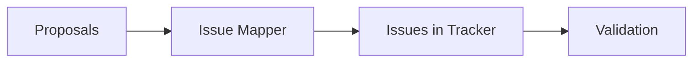

[← Index](./README.md) | [< Previous](./TEMPLATE-018-milestones-proposals.md) | [Next >](../06-development/README.md)

---

# Issue Mapping

## Purpose

The Issue Mapping document provides **traceability between planning artifacts and issue tracker items**. It ensures every proposal has a corresponding ticket and validates the completeness of the plan.

## What This Document Describes

1. Mapping from proposals to issue IDs
2. Mapping from epics to issue IDs
3. Consolidation of duplicates
4. Dependency matrix validation
5. Creation checklist

## Diagram Convention

Use a flowchart to show mapping flow:



---

## Philosophy

### Why Issue Mapping

Without issue mapping:
- Proposals are not tracked
- Progress cannot be measured
- Duplicates go unnoticed
- Stakeholders lack visibility

### Mapping Principles

1. **One proposal → One issue**: Each proposal maps to exactly one issue
2. **One epic → Multiple issues**: Epics break into issue sprints
3. **Issue references proposals**: Link issue back to source

---

## Issue Template

```markdown
### Issue: [Title]

**Issue ID**: [Tracker ID, e.g., PROJ-123]  
**Type**: Task / Bug / Feature / Story  
**Status**: [Open / In Progress / Done]  
**Epic Link**: [Epic Name]

**Proposal(s)**:
- T-XXX: [Proposal title]
- V-XXX: [Variant title]

**Dependencies**:
- Blocked by: [PROJ-XXX]
- Blocks: [PROJ-XXX]

**Acceptance Criteria**:
- [ ] Criteria 1
- [ ] Criteria 2

**Owner**: [Assignee]
**Estimate**: [X] points
```

---

## Mapping Table

### Proposals → Issues

| Proposal | Issue ID | Status | Owner |
|----------|----------|--------|-------|
| T-030 | PROJ-101 | Open | @user1 |
| T-031 | PROJ-102 | Open | @user1 |
| T-023 | PROJ-103 | Open | @user2 |
| V-067 | PROJ-104 | Open | @user2 |
| T-051 | PROJ-105 | Open | @user3 |

### Epics → Issues

| Epic | Issue IDs | Status |
|------|----------|--------|
| Epic 1: Authentication | PROJ-100, PROJ-101, PROJ-102 | Open |
| Epic 2: Access Control | PROJ-103, PROJ-104 | Open |

---

## Duplicate Detection

### Consolidation Check

| Duplicate Found | Action |
|-----------------|--------|
| Two proposals covering same scope | Merge into one proposal |
| Proposal already in issue tracker | Reference existing issue |
| Use case not mapped to proposal | Create new proposal |

### Validation Checklist

- [ ] All proposals have issue references
- [ ] No duplicate proposals
- [ ] All issue dependencies are documented
- [ ] All epics have issue breakdown
- [ ] Owners assigned

---

## Dependency Matrix

| Issue | Blocks | Blocked By |
|-------|--------|------------|
| PROJ-101 | PROJ-102 | — |
| PROJ-102 | PROJ-103 | PROJ-101 |
| PROJ-103 | — | PROJ-102 |

---

## Step-by-Step Guide

1. **Export proposals**: From Milestones & Proposals
2. **Create issues**: One per proposal
3. **Link to epics**: Map issues to epics
4. **Document dependencies**: Blocks/blocked by
5. **Assign owners**: Team members
6. **Validate completeness**: Checklist
7. **Remove duplicates**: Consolidation
8. **Share with team**: Update tracker

---

## Tips

1. **Create in batches**: Generate all issues at once
2. **Use labels**: Tag by epic/context
3. **Set estimates**: Story points for velocity
4. **Add to sprints**: Plan in tracker
5. **Link both ways**: Issue → Proposal AND Proposal → Issue

---

[← Index](./README.md) | [< Previous](./TEMPLATE-018-milestones-proposals.md) | [Next >](../06-development/README.md)