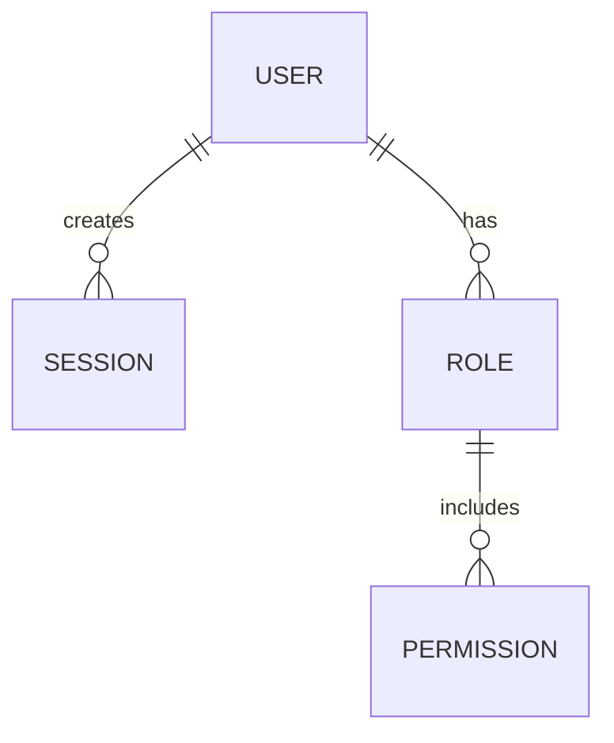

# AI Workflow Guide

How to **practically** work with Claude (or similar) to generate complete documentation, phase by phase.

---

## Table of Contents

- [General Flow](#general-flow)
- [Preparation (Day 1)](#preparation-day-1)
- [Discovery (Day 2-3)](#discovery-day-2-3)
- [Requirements (Day 4-5)](#requirements-day-4-5)
- [Design (Day 6-7)](#design-day-6-7)
- [Data Model (Day 8)](#data-model-day-8)
- [Planning (Day 9)](#planning-day-9)
- [Development & more (Day 10+)](#development--more-day-10)
- [Validation and maintenance](#validation-and-maintenance)
- [Advanced troubleshooting](#advanced-troubleshooting)

---

## General Flow

```
┌─────────────────────────────────────────────────────────┐
│ 1. PREPARE: Gather product information                 │
│    (20-30 min)                                           │
└──────────────────────────┬──────────────────────────────┘
                           ↓
┌─────────────────────────────────────────────────────────┐
│ 2. INITIAL PROMPT: Create context doc for AI           │
│    (5 min — copy/edit INSTRUCTIONS-FOR-AI.md)          │
└──────────────────────────┬──────────────────────────────┘
                           ↓
┌─────────────────────────────────────────────────────────┐
│ 3. GENERATE: Pass prompt + template to Claude          │
│    (1-5 min per doc, wait for response)                 │
└──────────────────────────┬──────────────────────────────┘
                           ↓
┌─────────────────────────────────────────────────────────┐
│ 4. VALIDATE: Review checklist, adjust if necessary     │
│    (5-15 min per doc)                                   │
└──────────────────────────┬──────────────────────────────┘
                           ↓
┌─────────────────────────────────────────────────────────┐
│ 5. SAVE: Accept doc, rename from TEMPLATE-* to real    │
│    (1 min)                                              │
└──────────────────────────┬──────────────────────────────┘
                           ↓
┌─────────────────────────────────────────────────────────┐
│ 6. NEXT: Next phase (repeat 2-5)                      │
└─────────────────────────────────────────────────────────┘
```

---

## Preparation (Day 1)

### Step 1: Gather key information

Before opening Claude, prepare these documents:

```
📋 PRODUCT INFO (copy into a text doc)

Name: [your product]
Problem: [what problem it solves, 2-3 clear sentences]
Users: [who uses it, 2-3 main profiles]
Market: [context, competition, opportunity]
Constraints: [legal, technical, business limits if any]
Stack: [Backend, Frontend, DB, Infra — for phases 6+]

Additional context:
- Existing documentation: [do you have previous documents? Links]
- Stakeholders: [who approves what]
- Timeline: [is there a deadline?]
- Success metrics: [how do you know you won]
```

**Practical example for "Keygo"**:

```
Name: Keygo
Problem: Development teams lose 2+ hours/day managing
         sessions and permissions — no single source of truth
Users:
  - Developers (build features)
  - DevOps/Platform Engineers (maintain infrastructure)
  - PM/Managers (audit, control)
Market: Competes with homegrown solutions, ad-hoc scripts,
         or generic tools (Vault, etc.) that are too complex
Constraints: Must integrate with existing infrastructure (K8s, cloud)
Stack: Backend: Go + gRPC, Frontend: React, DB: PostgreSQL, Infra: K8s
```

### Step 2: Create local structure

On your machine:

```bash
# Option 1: Copy the complete template
cp -r ddd-hexagonal-ai-template/ /your/project/docs

# Option 2: If you already have the template, update name:
cd ddd-hexagonal-ai-template
# Rename MACRO-PLAN.md and TEMPLATE- files
```

### Step 3: Prepare your AI session

Open Claude Code or claude.ai. **Important**: In one Claude session:

1. Create a document/conversation called `[PRODUCT]-docs-generation`
2. Paste the "PRODUCT INFO" above as permanent context
3. Save the conversation to reuse context

```markdown
# 🎯 PROJECT CONTEXT [KEYGO]

[Paste product-info here]

---

# Documents to Generate

- [ ] 01-templates/01-discovery/context-motivation.md
- [ ] 01-templates/01-discovery/system-vision.md
- [ ] ... (list all documents you need)

---

# Next step: Discovery
```

---

## Discovery (Day 2-3)

### Document 1.1: Context & Motivation

**Task**: Generate `01-templates/01-discovery/context-motivation.md`

#### Your prompt (copy and adapt):

```markdown
# Product Context

[PASTE PRODUCT INFO here]

---

# Task

Generate the file "01-templates/01-discovery/context-motivation.md"
based on the attached template.

---

# Template

[COPY COMPLETE from TEMPLATE-context-motivation.md]

---

# Specific Requirements

## Content
- Length: 2000-2500 words
- Mandatory sections:
  1. **Concrete Problem**: What is the real problem? (not "users need X", but "teams lose 2h/day because...")
  2. **Market Context**: Competition, trends, why now
  3. **Strategic Motivation**: Why is it important for the business
  4. **Actors and Impacted**: Who wins/loses if we do this
  5. **Initial Risks**: What could go wrong (technical, business, user)
  6. **Opportunities**: If it works, what do we gain
  7. **Key Assumptions**: What we take for true (ex: "users want X" — but does AI know or should it assume?)

## Style
- Agnostic: DO NOT mention technologies (no "Kubernetes", no "React", no "gRPC")
- Replace "databases" with "information storage"
- Replace "REST API" with "integration interface"
- Accessible to non-technical people (PM, executives must understand)
- Narrative but professional (not salesy)

## Concrete Data
- If I mention "teams lose 2h/day", is it true or an estimate? (be specific)
- Include real numbers (market, users, competition)
- Cite competitor examples if they exist (Vault, 1Password, etc.)

---

# Validation

After writing, make sure that:

- [ ] Clearly answers "What is the problem?"
- [ ] Differentiates between "problem" (what's wrong) vs "vision" (how to fix it)
- [ ] Does not prescribe technical solutions
- [ ] Includes concrete risk analysis (not "could fail", but "could fail because X")
- [ ] All sections are present
- [ ] Paragraphs don't exceed 4 lines
- [ ] Clear language (0 jargon without explanation)
```

#### How to use:

1. **Copy prompt above** (adapt numbers/context)
2. **Open Claude**
3. **Paste the prompt**
4. **Wait for response** (1-3 minutes typically)
5. **Copy the generated markdown** to `01-templates/01-discovery/context-motivation.md`

#### Quick validation (checklist):

```
✅ "Problem" Section: Is the specific problem clear?
✅ "Market" Section: Is competition and opportunity understood?
✅ No technology: Are there no mentions of "database", "API", "framework"?
✅ Concrete numbers: Are there real data points? (not just "many users")
✅ Risks: Are they documented? Do they have explanation?
✅ Tone: Is it professional but narrative (not boring)?
```

**If any check fails**: Use `REQUEST ADJUSTMENT` (see below).

---

### Document 1.2: System Vision

**Task**: Generate `01-templates/01-discovery/system-vision.md`

#### Your prompt (copy and adapt):

```markdown
# Context from Previous Phase

[Make a brief summary of context-motivation.md — 2-3 paragraphs]

Identified problem: [1 line]
Opportunity: [1 line]

---

# Task

Generate "01-templates/01-discovery/system-vision.md" based on the template.

---

# Template

[COPY COMPLETE from TEMPLATE-system-vision.md]

---

# Requirements

## Content
- Length: 1500-2000 words
- Mandatory sections:
  1. **Long-Term Vision** (3-5 years): What is the aspirational future?
  2. **What is [PRODUCT]?** (clear definition, 200 words)
  3. **What is it NOT?** (explicit limits — what we will never do)
  4. **Guiding Principles** (3-5 values/principles that guide decisions)
  5. **Expected Benefits** (for users, business, team)
  6. **Differentiation** (how we differ from competition)
  7. **Success Metrics** (how we'll know we won — must be measurable)

## Style
- Agnostic (no technology)
- Inspirational but realistic (not "utopia")
- Tangible (ex: "teams save 5 hours/week" is better than "will be revolutionary")

---

# Validation

After writing:

- [ ] Is it different from context-motivation (one is problem, other is vision)?
- [ ] Explicit limits? (what it is NOT)
- [ ] Are success metrics measurable?
- [ ] Are benefits quantitative if possible?
- [ ] Inspiring but honest tone?
```

**Note**: This document is the "north star" — the goal. Connects problem (discovery 1.1) with solution (requirements, design).

---

### Document 1.3: Actors & Needs

**Task**: Generate two documents:
- `01-templates/01-discovery/actors.md`
- `01-templates/01-discovery/needs-expectations.md`

#### Your prompt (copy and adapt):

```markdown
# Context

[Summary of vision + context-motivation]

---

# Task

Generate two documents:
1. "01-templates/01-discovery/actors.md"
2. "01-templates/01-discovery/needs-expectations.md"

---

# Template

[COPY TEMPLATE-actors.md]
[COPY TEMPLATE-needs-expectations.md]

---

# Document 1: Actors (1500 words)

## Mandatory Content

For each actor (4-7 main actors):
1. **Name/Role**: (ex: "Platform Engineer")
2. **Who are they?**: Profile, age, typical experience
3. **What do they currently do?** (without your product)
4. **Pain point**: What frustrates them today
5. **Incentives**: What they care about (money, time, recognition, etc.)
6. **Constraints**: Limitations they have (policies, licenses, knowledge)
7. **Relationship with other actors**: How they interact

## Style
- User-centric (real people, not abstractions)
- Agnostic
- Include examples: "It's Monday 9am, Juan must configure permissions for new DevOps..."

---

# Document 2: Needs & Expectations (2000 words)

## Mandatory Content

For each actor:
1. **Need 1**: What they need, why it's important
2. **Expectation**: How they expect it to be resolved (high level)
3. **Current alternatives**: What they do today (manual, tools, scripts)
4. **Problems with alternatives**: Why it doesn't work
5. **Conflict with other actors**: If any (ex: DevOps wants X, Developer wants Y)
6. **Success criterion**: How they would know this works

Include prioritization table (Must / Should / Could)

## Style
- Concrete (not "users need better UX" → "users need to find the permissions section in <5 seconds")
- Agnostic

---

# Validation

After writing:

- [ ] Do they cover all identified stakeholders?
- [ ] Does each pain point have a specific "why"?
- [ ] Do the needs connect with later requirements?
- [ ] Are conflicts documented and explained?
- [ ] Are the examples concrete?
```

---

## Requirements (Day 4-5)

### Document 2.1: Glossary

**Task**: Generate `01-templates/02-requirements/glossary.md`

#### Your prompt:

```markdown
# Context

[Discovery completed]

Identified domains: [ex: Identity, Authorization, Billing]

---

# Task

Generate "01-templates/02-requirements/glossary.md" with domain terms.

---

# Template

[COPY TEMPLATE-glossary.md]

---

# Requirements

## Content
- 30-50 key domain + technical terms
- For each term:
  1. **Term** (keyword)
  2. **Definition** (1-2 clear sentences)
  3. **Context** (when/where it's used)
  4. **Synonyms** (if they exist)
  5. **Related to** (other terms)
  6. **Example** (concrete case)

## Important
- Agnostic: "session token" NOT "JWT token"
- Self-explanatory: every term must be defined without using undefined ones
- Inclusive: both business and technical terms

## Expected examples (adapted to your domain)

| Term | Definition | Ex |
|---------|-----------|-----|
| Session | Authenticated user state | "Juan logged in at 9am" |
| Permission | Authorization to perform action | "Admin has permission to create users" |
| Role | Set of permissions | "DevOps = create secrets + view logs" |

---

# Validation

- [ ] 30-50 terms?
- [ ] Is every term understandable without external definitions?
- [ ] Does it cover business AND technical vocabulary?
- [ ] Are examples clear?
```

---

### Document 2.2: Functional & Non-Functional Requirements

**Task**: Generate individual requirement documents

#### Step 1: Prepare base list

Before asking AI, **YOU** make a quick list of what the system must do:

```
FUNCTIONAL REQUIREMENTS (FR)

FR-001: User can log in
FR-002: Admin can create new session
FR-003: User can view active missions
FR-004: System revokes expired session
...

NON-FUNCTIONAL REQUIREMENTS (NFR)

NFR-001: Maximum request latency: 500ms
NFR-002: Availability: 99.9%
NFR-003: Support 10k simultaneous users
...
```

#### Step 2: Prompt for AI

```markdown
# Context

[Discovery + Glossary]

---

# List of Requirements to Detail

## Functional (FR)
- FR-001: User can log in
- FR-002: Admin can create new session
- FR-003: User can view active missions
...

## Non-Functional (NFR)
- NFR-001: Maximum request latency: 500ms
- NFR-002: Availability: 99.9%
...

---

# Task

For each FR/NFR, generate individual document:
- "01-templates/02-requirements/functional/fr-001-user-authentication.md"
- "01-templates/02-requirements/non-functional/rnf-001-latency.md"
...

---

# Template per Requirement

[COPY TEMPLATE-fr-template.md]
[COPY TEMPLATE-rnf-template.md]

---

# Mandatory Structure (PER EACH FR)

1. **ID and Name** (FR-001: User Authentication)
2. **Description** (what the system must do — max 100 words)
3. **Justification** (why it's important — connect with Discovery/Needs)
4. **Acceptance Criteria** (Gherkin: Given/When/Then)
   ```gherkin
   Scenario: User can log in with valid credentials
     Given a user with email "juan@example.com"
     When they enter password "secure123"
     Then they are authenticated
     And they see their dashboard
   ```
5. **Dependencies** (does it need other FR?)
6. **Risks/Considerations** (what can go wrong)
7. **Implementation Notes** (agnostic, but useful context)

---

# Special Requirements

## Agnostic
NO: "The system must use JWT for tokens"
YES: "The system must generate secure tokens with expiration"

## Verifiable
NO: "The system must be fast"
YES: "The system must respond in <500ms at 99th percentile"

## Connected
Each FR must connect with at least one Discovery Need

---

# Validation

- [ ] Is each FR independent (can be understood alone)?
- [ ] Are acceptance criteria verifiable?
- [ ] Is there no prescribed technology?
- [ ] Does it connect with identified needs?
- [ ] Are risks specific (not generic)?
```

---

### Document 2.3: Priority Matrix & Scope Boundaries

**Task**: Generate `01-templates/02-requirements/priority-matrix.md` and `scope-boundaries.md`

#### Your prompt:

```markdown
# Context

[All FR/NFR generated]

Tentative MVP: [ex: "FR-001, FR-003, FR-004"]

---

# Task

Generate two documents:
1. "01-templates/02-requirements/priority-matrix.md"
2. "01-templates/02-requirements/scope-boundaries.md"

---

# Document 1: Priority Matrix

Use MoSCoW matrix:
- **Must**: Absolutely necessary for MVP (can't do without this)
- **Should**: Important but not blocker (v1.1)
- **Could**: Nice to have (future roadmap)
- **Won't**: Explicitly out of scope (discarded)

Expected table:

| ID | Name | Category | Justification | Effort |
|----|--------|-----------|---------------|----------|
| FR-001 | User Auth | Must | Core of product | High |
| FR-005 | Analytics | Should | Useful for PM | Medium |

---

# Document 2: Scope Boundaries

## Mandatory content

1. **Defined MVP**: What is the exact MVP (FR Must + some Should)
2. **Within Scope** (MVP):
   - FR-001, FR-002, ...
   - Reason: core functionality

3. **Explicitly OUT of Scope**:
   - FR-015: Machine Learning
   - Reason: requires 6 months of research
   - When: v2.0 (Q3 2026)

4. **External Dependencies**: [ex: "Requires integration with Vault — Platform team must provide credentials"]

---

# Validation

- [ ] Is MVP clear? (does someone understand it without asking?)
- [ ] Are limits explicit? (not just the unmentioned)
- [ ] Are reasons clear?
```

---

## Design (Day 6-7)

### Document 3.1: Strategic Design (Bounded Contexts)

**Task**: Generate `01-templates/03-design/strategic-design.md`

#### Your prompt:

```markdown
# Context

[Requirements completed]

Identified domains (from glossary): Identity, Authorization, Audit

---

# Task

Generate "01-templates/03-design/strategic-design.md" with DDD model.

---

# Template

[COPY TEMPLATE-strategic-design.md]

---

# Mandatory Structure

1. **Domain Vision Statement** (why these contexts, what problem they solve together)

2. **Subdomain Classification**:

   | Domain | Type | Reason |
   |---------|------|-------|
   | Identity | Core | Differentiation (we are the best at identity management) |
   | Authorization | Core | Differentiation (our permission model is innovative) |
   | Audit | Supporting | Necessary but not differentiating

3. **Bounded Contexts** (1 section per context):
   - **Identity Context**
     - Purpose: Manage authentication and user profile
     - Ubiquitous Language: Session, User, Credential, Authentication
     - Root Aggregates: User (root), Session (entity)
     - Responsibility: Only authentication, NOT authorization

   - **Authorization Context**
     - Purpose: Manage what user can do what
     - Ubiquitous Language: Role, Permission, Resource, Policy
     - Root Aggregates: Role, Resource
     - Responsibility: Only authorization, NOT authentication

   - **Audit Context**
     - Purpose: Record who did what when
     - Ubiquitous Language: Event, Act, Result
     - Responsibility: Immutable log

4. **Interfaces Between Contexts**:
   - Identity → Authorization: "when user authenticates, Authorization gets their role list"
   - Identity → Audit: "when user authenticates, Audit records the event"

---

# Important

- DDD-centric (use vocabulary: Bounded Context, Aggregate, Ubiquitous Language)
- Agnostic (no "PostgreSQL", no "gRPC")
- Justified (why these limits and not others)

---

# Validation

- [ ] Does each context have a single responsibility?
- [ ] Is ubiquitous language distinct per context?
- [ ] Are aggregates clear?
- [ ] Are interfaces documented?
```

---

### Document 3.2: System Flows

**Task**: Generate `01-templates/03-design/system-flows.md`

#### Your prompt:

```markdown
# Context

[Strategic Design + Requirements]

---

# Task

Generate "01-templates/03-design/system-flows.md" documenting main flows.

---

# Template

[COPY TEMPLATE-system-flows.md]

---

# Flows to Document (minimum 5-8)

For each flow:
1. **Name and Description** (what happens)
2. **Involved Actors** (who, what system)
3. **Steps** (order of actions):
   ```
   1. User opens browser
   2. System loads login page
   3. User enters credentials
   4. [Decision] Valid credentials?
      → Yes: Create session, redirect to dashboard
      → No: Show error, allow retry
   ```
4. **Diagram** (Mermaid sequence or flowchart)
5. **Alternative Cases** (what if user cancels, failed retries, etc.)
6. **Involved Contexts** (what Bounded Contexts participate)

---

# Expected Example

## Flow 1: User Login

1. **Description**: User logs in
2. **Actors**: User, Identity Context, Authorization Context, Audit Context
3. **Steps**:
   1. User opens login page
   2. Enters email + password
   3. Identity Context validates credentials
   4. [Success] Generate session token
   5. Authorization Context loads user roles
   6. Audit Context records login
   7. User sees dashboard with allowed options

4. **Diagram**:
   ```mermaid
   sequenceDiagram
     User->>Identity: POST /login (email, pwd)
     Identity->>Identity: validate credentials
     Identity->>Authorization: GET roles for user
     Authorization->>Authorization: load roles from DB
     Identity->>Audit: log "user login"
     Audit->>Audit: store event
     Identity->>User: return session token
   ```

---

# Validation

- [ ] Do they cover all main FR?
- [ ] Are domain contexts documented?
- [ ] Are diagrams readable?
- [ ] Are alternative cases documented?
```

---

### Document 3.3: Bounded Context Models

**Task**: Generate domain models per context

#### Your prompt:

```markdown
# Context

[Strategic Design completed]

Bounded Contexts: Identity, Authorization, Audit

---

# Task

Generate domain models for each context:
- "01-templates/03-design/bounded-contexts/identity.md"
- "01-templates/03-design/bounded-contexts/authorization.md"
- "01-templates/03-design/bounded-contexts/audit.md"

---

# Structure per Context (example: Identity)

## 1. Purpose and Responsibility
   Manage authentication and user profile.

## 2. Ubiquitous Language (10-15 terms)
   - Session: authenticated user state
   - User: unique identity
   - Credential: email/password pair or similar
   - [etc]

## 3. Main Aggregates

   | Aggregate | Root | Entities | Value Objects |
   |----------|------|-----------|----------------|
   | User | User (ID: UUID) | Profile | Email, Password (hashed) |
   | Session | Session (ID: UUID) | - | Token, ExpiresAt |

## 4. Domain Invariants
   - A user CANNOT have two active sessions simultaneously
   - Email must be unique
   - Session expires in 24 hours

## 5. Domain Events
   - UserAuthenticated
   - SessionCreated
   - SessionExpired
   - CredentialsUpdated

## 6. Interfaces (how it communicates)
   - Incoming: POST /login (username, password)
   - Outgoing: Calls Authorization.getPermissions(userId)
   - Events published: UserAuthenticated, SessionExpired

## 7. Design Decisions
   - Why don't we store sessions in memory? → We need to distribute
   - Why is email the identifier? → [business reason]

---

# Validation

- [ ] Is the responsibility clear?
- [ ] Are events BUSINESS events, not technical?
- [ ] Are invariants explicit?
- [ ] Are interfaces clear?
```

---

## Data Model (Day 8)

### Document 5.1: Entities & Relationships

**Task**: Generate `01-templates/04-data-model/entities.md` and `relationships.md`

#### Your prompt:

```markdown
# Context

[Design completed — Strategic Design + Bounded Contexts]

---

# Task

Generate two documents:
1. "01-templates/04-data-model/entities.md"
2. "01-templates/04-data-model/relationships.md"

---

# Document 1: Entities

## Structure per Entity

| Entity | Attributes | Constraints | Origin |
|---------|-----------|----------------|---------|
| User | id (UUID), email (string, unique), name (string), createdAt | Email must be valid | FR-001 (User Auth) |
| Session | id (UUID), userId (FK), token (string), expiresAt | Token must be unique | FR-001 |
| Role | id (UUID), name (string), description | Name unique per context | FR-003 |

## Content per Entity (1 section each)
1. **Name and Description**
2. **Attributes** (name, type, required/optional, constraints)
3. **Invariants** (what must always hold)
4. **Origin** (from which FR it comes)
5. **Special notes** (ex: soft delete, auditable, temporal)

---

# Document 2: Relationships

## ERD Diagram



## Relationships Table

| From | To | Type | Mandatory | Justification |
|----|---|------|-------------|----------------|
| User | Session | 1:N | No | User can have 0+ active sessions |
| User | Role | M:N | No | User can have multiple roles |
| Role | Permission | M:N | Yes | Each role MUST have at least 1 permission |

---

# Important

- DB Agnostic: no "SERIAL", no "VARCHAR(255)"
- Based on domain entities (from Design)
- Justified (each relationship must support a flow)

---

# Validation

- [ ] Is each entity a domain concept?
- [ ] Do relationships support system-flows.md flows?
- [ ] Is ERD readable?
```

---

## Planning (Day 9)

### Document 6: Roadmap & Epics

**Task**: Generate `01-templates/05-planning/roadmap.md` and `epics.md`

#### Your prompt:

```markdown
# Context

[Requirements + Design + Data Model completed]

MVP: [FR-001, FR-002, FR-003, ...]

---

# Task

Generate two documents:
1. "01-templates/05-planning/roadmap.md" (6-12 months)
2. "01-templates/05-planning/epics.md" (decomposition of FR into epics)

---

# Document 1: Roadmap

## Structure

```
## Phase 1: MVP (Q2 2026, 8 weeks)
- Objective: Users can authenticate and manage sessions
- FR Included: FR-001, FR-002, FR-003, FR-004
- Result: Minimum viable product
- Team: 2 Backend + 1 Frontend
- Risks: Integration with Vault (external dependency)

## Phase 2: Advanced Auth (Q3 2026, 6 weeks)
- Objective: Multi-factor authentication, SSO
- New FR: FR-010, FR-011
- Dependencies: Phase 1 must be in production
- Result: Support for large enterprises

## Phase 3: Analytics & Insights (Q4 2026+)
- Objective: PM and executives understand system usage
- New FR: FR-020, FR-021
- Dependencies: Phase 1 + 2
- Result: Adoption dashboards
```

---

# Document 2: Epics

Group FR by capability/feature:

```
## Epic 1: User Authentication
- FR-001: User login
- FR-002: User registration
- FR-004: Password reset
- Priority: Must
- Estimation: 21 story points
```

---

# Validation

- [ ] Is MVP clear and achievable in timeline?
- [ ] Are dependencies explicit?
- [ ] Are epics independent (or dependencies documented)?
```

---

## Development & more (Day 10+)

From here, the technical stack is specific. But the pattern is the same:

```markdown
# Technical stack (provide to AI)

Backend: Go 1.21, gRPC, PostgreSQL
Frontend: React 19, TypeScript, Vite
Infrastructure: Kubernetes, Docker, GitHub Actions

---

# Task

Generate "01-templates/06-development/architecture.md" and "api-reference.md"

[Follow structure from INSTRUCTIONS-FOR-AI.md — Phase 7]
```

**Note**: Phases 6-12 are technical — include tool names, code patterns, etc.

---

## Validation and Maintenance

### Post-Generation: Integral Validation

After generating each document:

```
✅ POST-GENERATION CHECKLIST

Content
- [ ] Answers the central question of the phase
- [ ] Includes all required sections
- [ ] Has sufficient detail (not too little, not excessive)
- [ ] Concrete examples (not just theory)

Style
- [ ] Accessible to the audience (technical, PM, executives)
- [ ] Professional but not pretentious
- [ ] Short paragraphs (max 4 lines)

Consistency
- [ ] Maintains tone of previous documents
- [ ] Uses glossary terms (no new words without definition)
- [ ] Cross-references work

Agnostic (phases 1-5)
- [ ] Doesn't mention frameworks/languages/DB
- [ ] Describes "what", not "how"

Format
- [ ] Valid Markdown
- [ ] Titles in correct hierarchy (H1, H2, H3)
- [ ] Lists and tables well formed
- [ ] Diagrams are readable
```

### Request Adjustments from AI

If any check fails:

```markdown
# Adjustment

The document "context-motivation.md" has a problem:

**Problem**: Mentions "relational database" but should be agnostic

**Requested Change**:
Replace the "Data Storage" section to:
- Remove mentions to specific DB
- Use agnostic language ("information storage")
- Keep everything else the same

[PASTE PROBLEMATIC PARAGRAPH]
```

AI understands the context and makes the adjustment quickly.

---

### Keep Documentation Alive

Once completed:

```
📋 WEEKLY RITUAL (15 minutes)

1. Were there architecture/scope changes this week?
   → Yes: Update corresponding documents

2. Are there new decisions?
   → Yes: Document in ADRs (Architecture Decision Records)

3. Is there stakeholder feedback?
   → Yes: Incorporate in requirements/design

4. Commit changes:
   git commit -m "docs: update [document] — [brief change]"
```

---

## Advanced Troubleshooting

### Problem: AI generates generic content

**Symptom**: Document could apply to any product

**Root cause**: Insufficient context

**Solution**:

```markdown
# Explicit Instruction

This document is for [SPECIFIC PRODUCT].

MUST include specific examples:
- [example 1 from your product]
- [example 2 from your product]
- [example 3 from your product]

DO NOT use generic examples of "a user". Use [YOUR SPECIFIC AUDIENCE].

---

[Repeat the prompt with MORE context]
```

### Problem: Documents inconsistent between phases

**Symptom**: Discovery says X, but Design says Y

**Root cause**: AI generated without seeing previous documents

**Solution**:

```markdown
# Context from Previous Phases

[COPY RELEVANT from discovery.md]
[COPY RELEVANT from requirements.md]

---

Make sure the new document:
- Uses the SAME terms (from glossary)
- Doesn't contradict previous decisions
- Connects explicitly (ex: "This design implements FR-001")
```

### Problem: AI forgets sections

**Symptom**: Document is shorter than expected, sections are missing

**Root cause**: Poorly structured prompt

**Solution**:

```markdown
# This document MUST include

1. [Section 1]
2. [Section 2]
3. [Section 3]
...

If any section is missing, the document is incomplete.

Verify BEFORE responding:
- Are all sections present?
- Does each section have sufficient detail?
```

### Problem: Incorrect length

**Symptom**: Document is too short (500 words) or too long (5000)

**Root cause**: Unclear expectation

**Solution**:

```markdown
# Length Requirement

Length: 2000-2500 words exactly

How to count: [Copy generated document here and count: wc -w]

If out of range:
- Too short: expand each section with more detail/examples
- Too long: reduce long paragraphs to 2-3 lines, eliminate redundancy
```

---

## Summary: Complete Flow

```
Day 1: Preparation (PRODUCT INFO)
       ↓
Day 2-3: Discovery (3 docs)
         ↓
Day 4-5: Requirements (3 docs)
         ↓
Day 6-7: Design (3 docs)
         ↓
Day 8: Data Model (2 docs)
       ↓
Day 9: Planning (2 docs)
       ↓
Day 10+: Development & Post-Production (6+ docs)
         ↓
Integral Validation & Maintenance
```

**Total time**: 10-15 work days (with AI)
**Human effort**: ~20-30 hours (reading, validation, adjustments)

---

[← HOME](../README.md)
